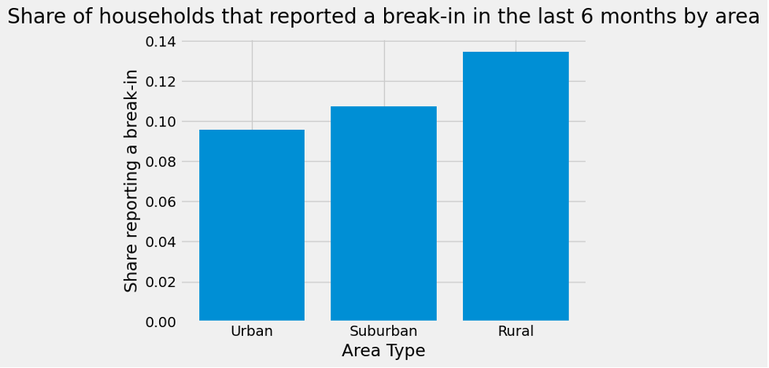

# Crime Data Analysis (NCVS 2020)

This repository contains a data science class project analyzing crime victimization patterns using the **2020 National Crime Victimization Survey (NCVS)** incident dataset.

The goal of this project is to explore how different types of victimization vary across demographic and geographic groups, using real survey-based crime data.

---

## 📌 Project Overview

This analysis focuses on questions such as:

- How do break-in incidents differ between **urban, suburban, and rural** areas?
- How does theft victimization vary across **age groups**?
- What demographic patterns appear in reported incidents?

The dataset used here represents an **incident-only subset**, meaning each row corresponds to a reported victimization event rather than the full surveyed population.

---

## Example Visualization

This project compares break-in rates across urban, suburban, and rural areas:



---

## 📂 Repository Contents

| File | Description |
|------|------------|
| `Project118_Fall2023.ipynb` | Jupyter Notebook containing the full analysis, code, and visualizations |
| `National_Crime_Project_report.pdf` | Written report summarizing findings, methodology, and interpretation |
| `README.md` | Project documentation (this file) |

---

## 📊 Dataset Information

- Source: **National Crime Victimization Survey (NCVS), 2020**
- Observations: ~8,000 reported incidents
- Format: CSV file (`NCVS_2020.csv`)

⚠️ **Important:**  
The dataset file `NCVS_2020.csv` was provided as part of a course assignment and is not included in this public repository.

To run the notebook, you must obtain the dataset separately and place it in the project directory (or inside a `data/` folder):

```bash
data/NCVS_2020.csv
